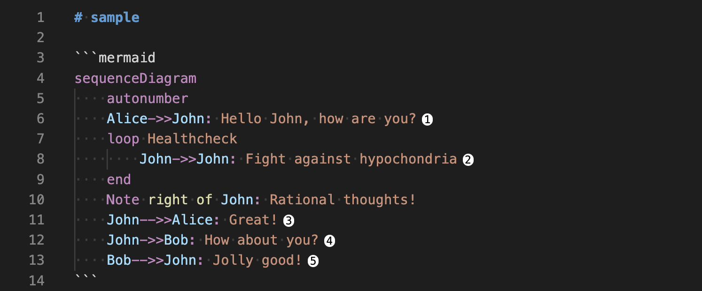
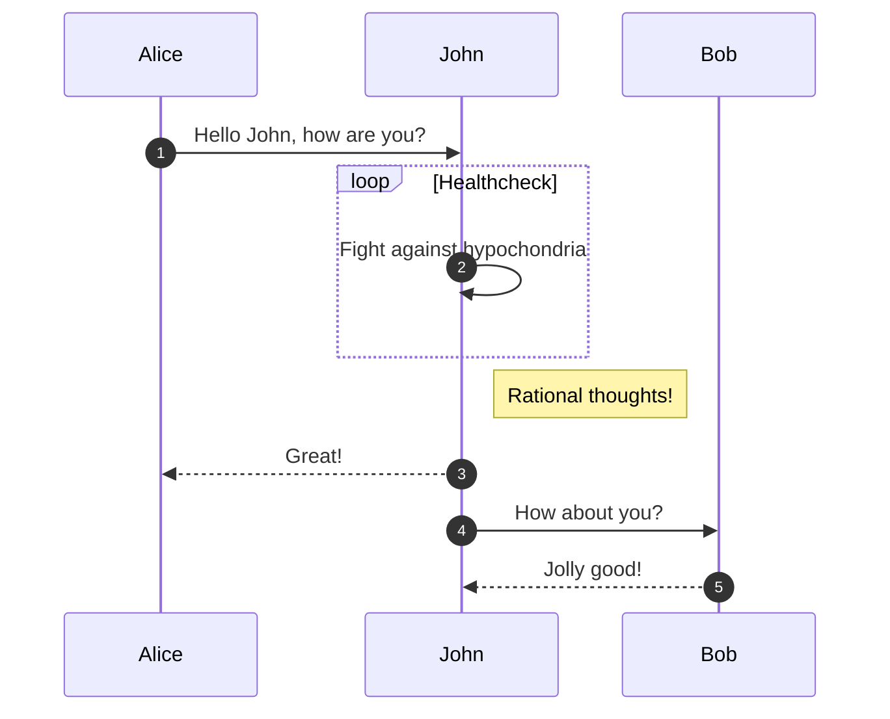

# mermaid-sequence-number

Visual Studio Code's extention for [Mermaid](https://github.com/mermaid-js/mermaid).
this extention decorate each line in editor when `autonumber` is turned on in the sequence diagram.



## Usage

1. install this extention
2. open the markdown file containing Mermaid that is enabled autonumber in sequence diagram

[example](https://mermaid-js.github.io/mermaid/#/sequenceDiagram?id=sequencenumbers)

````markdown

````

## Support

- markdown file only(yet doesn't support mmd file)
- this extention is applied to file less than equal 1000 lines
