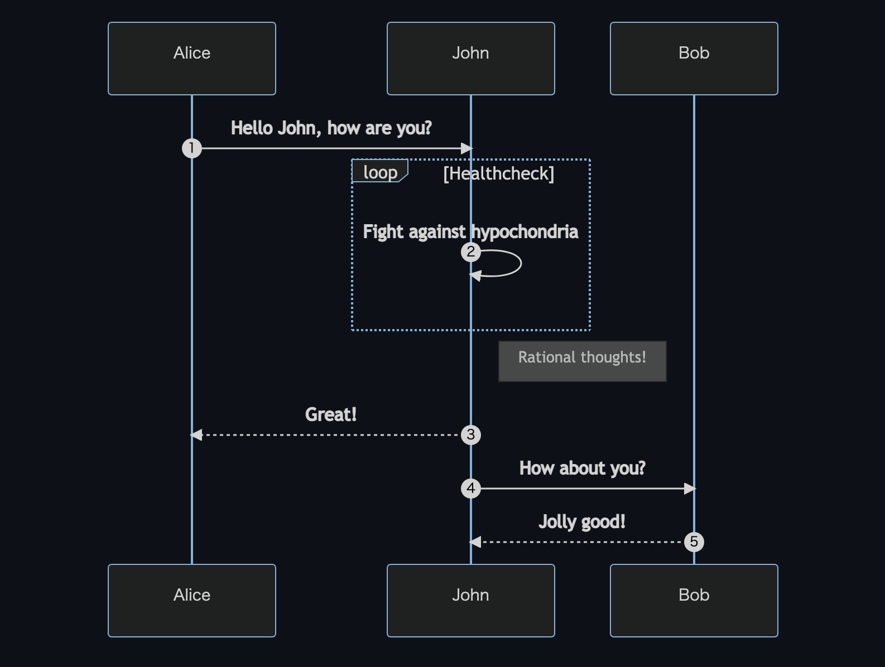
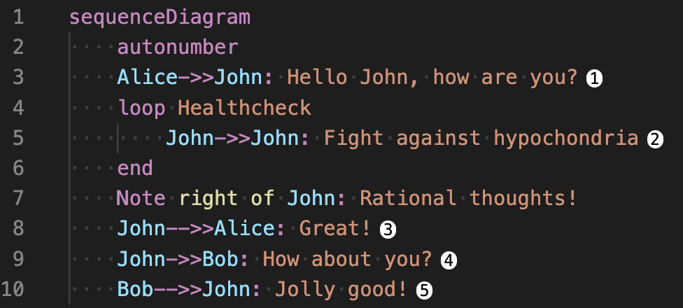
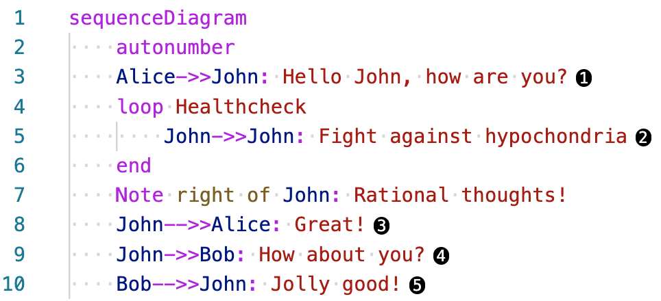

# Mermaid Sequence Number

Visual Studio Code's extention for [Mermaid](https://github.com/mermaid-js/mermaid).
This extention decorate each line on editor when `autonumber` is turned on in the sequence diagram.

## Usage

1. If you write sequence diagram turn on `autonumber` like [example](https://mermaid-js.github.io/mermaid/#/sequenceDiagram?id=sequencenumbers).

2. Each message is decorated on editor.

**Dark theme**

**Light theme**

## Support

- Markdown ( `.md` )
- mermaid ( `.mm` )
- applied to file less than equal 1000 lines
